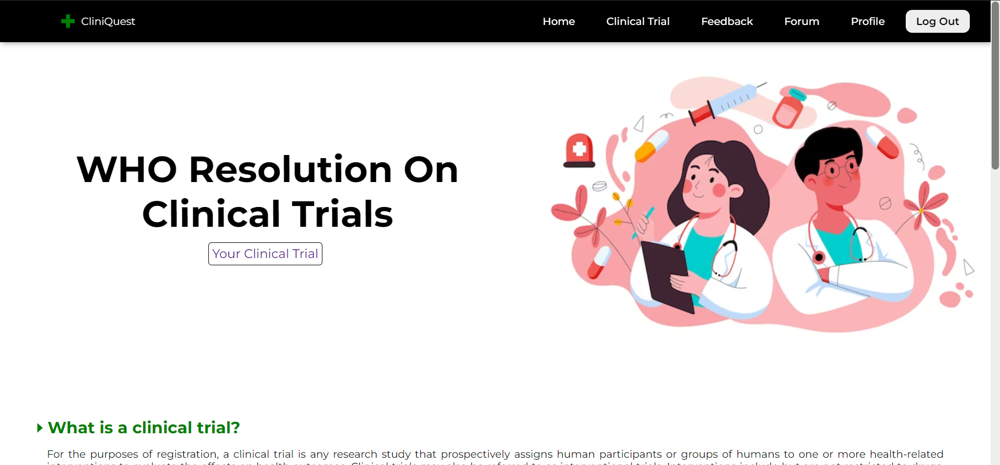
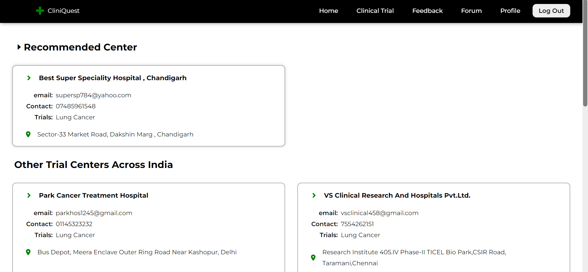

# Problem Statement
Nowadays cancer clinical trials are creating tremendous problem especially in India as cancer diagnosed patients are not aware of the trials/treatment happening in their or nearby cities.

**`Clinical Trials`** means the treatment programs which is offered sometimes by a hospital or sometimes by government's aid, these offer good medical facilities and they often promote individuals to get their health checked

# Introduction about the problem
As cancer is a very serious disease and it in any case should not be taken lightly, we figured out a machine learning model that tells the user the best cancer treatment hospital available as per one's disease, stage, gender etc.



# The Solution
We created a machine learning model that asks the following queries from user :
* Age
* Weight
* Height
* Location
* Blood Group
* Disease
* Stage
* Cancer(0/1)
* Gender

Using these parameters we trained a Scikit-Learn based machine learning model which predicts the best hospital or center that is available to a patient, the model's prediction is not always all accurate and it may give false output




# Presentation
[**`Google Slides`**](https://docs.google.com/presentation/d/10wlNkXw90fONtBVJ0H9Q-0NB37deeQ5d9BRQtqF-nDo/edit?usp=sharing)

# Technologies used:
**`Pandas`**, **`Numpy`**,  **`Scikit-Learn`**, **`React`**, **`Django`**, **`Node`**, **`MongoDB`**

# Team Members:
* [Aakarsh Beohar](https://github.com/aakarsh-2004)
* [Anshika Beohar](https://github.com/anshika-b)
* [Abhishek Mishra](https://github.com/AbhiMishra-24)
* [Amisha Raj](https://github.com/amisha2208)

# Information about the project's directory

### Outer files
The **`data.csv`** file consists of all the data that the model is trained on, you may open to analyze the model further. 
`designed_model.ipynb` is the notebook file which is used for the complete data science part.
**Note**: OneHotEncoding is being used while training the model.

### The backend files
> You may need to install all the necessary dependencies

#### Install cors and all the necessary libararies by typing
```
pip install django djangorestframework django-cors-headers scikit-learn==1.2.2 pandas numpy
```
**NOTE:** Remember to check paths wherever imports are there
  
The folder `api` consists of the backend files which are created using `django` framework of python. 
To run the backend server, go one step into api and type

```
python manage.py runserver
```

Inside the subdir `api` of api, there is a `views` file in which all python function are written, they gets executed when the particular api is called.
To define those particular parameters we use `urls` file, all the links that are to be hitted and used are defined there.
Changing the `settings` file is generally not recommended if everything is working but if it's not then you may need to make the necessary changes to setup `cors`.


**For Node.js backend**:
#### First install all the dependencies by typing in the node_backend folder:
```
npm install
```

To run the server, type
```
npm start
```
Our main file `app.js` consists of all the necessary API endpoints which helps us further to load and display the data.
Then there are Schemas files like `citiesSchema.js`, `trialcenterSchema.js` and `userSchema.js` which helps us to define the schema for our data that has to be stored, as we have a MongoDB database


### The Frontend files
**`React`** has been used for the complete Frontend part, to make the API calls in React `Fetch` and `axios` have been used.

#### First install all the necessary dependencies by going inside the frontend folder and type:

```
npm install
```

To start React server, open the main file in terminal and then type
```
npm start
```
and it should begin the server.
**Note:** There are 3 servers running for the proper working of our model.

# Project's Features
* It offers a great help (if not accurate) to cancer diagnosed patients
* The website is completely full stack, it means things like auth, cookies and sessions are implemented along with login and register
* Due to the presence of two backend languages, it offers us multiple things to do simultaneously, even API contacting API!

# Limitations of the project as of now
* Due to lack of data, the model overfits a little.
* As of now the model only shows output for some cities because of the limitations of dataset.


# We took part in following MLH competitions
* Best use of MongoDB Atlas
* Most creative use of GitHub
